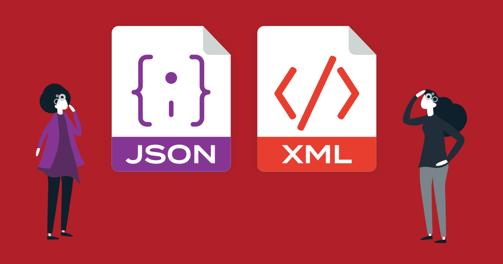

# 3장. 리소스와 표현

> 발표일 `24.11.12`
>
> 발표자 `박지환`

## 목차

1. 요약
2. 멱등성 & 안전성
3. 로이 폴딩
4. 질문

---

## 1. 요약

1. 리소스와 표현이란?

- 리소스: 모든 것이 리소스가 될 수 있다. ex. 문서, 이미지, 서비스, 컬렉션 등
- 표현: 리소스의 상태. ex. JSON, XML, HTML 등 (Body라고 생각하면 됨)

2. HTTP 의미 체계

- RESTful 세계에서는 리소스를 식별하는 규칙이 HTTP 프로토콜에 정의되어 있다.
- GET, DELETE, POST, PUT, HEAD, OPTIONS, PATCH, LINK, UNLINK.

---

## 2. 멱등성 & 안전성

- 멱등성: 동일한 요청을 여러 번 보내도 결과가 동일한 성질
- 안전성: 리소스를 변경하지 않는 성질

| HTTP 메소드 | 멱등성 | 안전성 | 설명                                                                                                                       |
| ----------- | ------ | ------ | -------------------------------------------------------------------------------------------------------------------------- |
| **GET**     | 예     | 예     | 리소스를 조회하며 상태를 변경하지 않습니다. 동일한 요청을 여러 번 보내도 결과가 동일합니다.                                |
| **DELETE**  | 예     | 아니오 | 리소스를 삭제합니다. 요청을 반복해도 첫 번째 요청과 동일한 효과를 가지지만, 상태가 변경되므로 안전하지 않습니다.           |
| **POST**    | 아니오 | 아니오 | 새로운 리소스를 생성하거나 데이터를 제출합니다. 멱등성이 없으며, 요청을 여러 번 보내면 중복된 리소스가 생성될 수 있습니다. |
| **PUT**     | 예     | 아니오 | 리소스를 완전히 대체합니다. 반복 요청 시 결과가 동일하여 멱등성이 있습니다.                                                |
| **HEAD**    | 예     | 예     | GET과 유사하나, 헤더만 조회합니다. 안전하고 멱등성이 있습니다.                                                             |
| **OPTIONS** | 예     | 예     | 대상 리소스에 대한 통신 옵션을 설명합니다. 안전하고 멱등성이 있습니다.                                                     |
| **PATCH**   | 아니오 | 아니오 | 리소스를 부분적으로 업데이트합니다. 반복 요청 시 다른 결과가 나올 수 있으므로 멱등성이 보장되지 않습니다.                  |
| **LINK**    | 예     | 아니오 | 리소스 간 관계를 설정합니다. 요청을 반복해도 결과가 동일하므로 멱등성이 있지만, 상태가 변경되므로 안전하지 않습니다.       |
| **UNLINK**  | 예     | 아니오 | 리소스 간의 관계를 제거합니다. 반복해도 동일한 결과를 가지므로 멱등성이 있지만, 상태가 변경되므로 안전하지 않습니다.       |

---

## 3. 로이 폴딩 (Roy Fielding)

- 로이 폴딩: REST의 아버지. REST의 제약 조건을 정의하고, 이를 준수하는 시스템을 RESTful하다고 부른다.
- [LinkedIn](https://www.linkedin.com/in/royfielding/)

- HTTP/1.0 프로토콜 작업 중, 어떻게 하면 기존 WEB을 망가뜨리지 않고 HTTP를 진보시킬까? 라는 고민을 했고, REST를 만들게 되었다.

- REST를 따르지 않는 API는 HTTP API라고 부른다. (안그러면 Roy Fielding이 뒤에서 쫓아온다.)

- 참고자료: [그런 REST API로 괜찮은가](https://velog.io/@toto9602/%EC%A0%95%EB%A6%AC%EA%B8%80-%EA%B7%B8%EB%9F%B0-REST-API%EB%A1%9C-%EA%B4%9C%EC%B0%AE%EC%9D%80%EA%B0%80)

---

## 4. 질문

### (공병규) 질문 1

> 주로 웹 환경에서 쓰이는 http 메소드는 GET,POST,PUT,DELETE,PATCH인 것 같은데, 그 외의 OPTIONS 메소드는 언제 쓰일까요?

---

### (정시우) 질문 2

> HEAD 메소드를 사용해도 "적절한 헤더"를 만들어야 하기 때문에 시간이 줄지 않는다는 표현이 있는데, 정확히 어떤 의미이고 이유는 무엇일까요?

---

### (이창준) 질문 3

> DELETE 의 성공 응답 코드 예시로 202가 있던데, 해당 코드는 나중에 삭제 하겠음을 의미한다고 합니다.
> 그럼 클라이언트 입장에서 성공 응답 코드를 받았지만 서버에서 요청을 처리하는 과정에서 오류가 생겨 202 코드를 반환 후 실패하는 상황이 생길 수도 있나요?

---

### (정예찬) 질문 4

> 자신만의 새로운 메서드를 정의하는 것이 좋을까요? 만약 복잡한 비즈니스 로직을 처리하기 위해 커스텀 메서드를 정의해야 한다면, 어떤 원칙을 세우는 것이 좋을까요?
