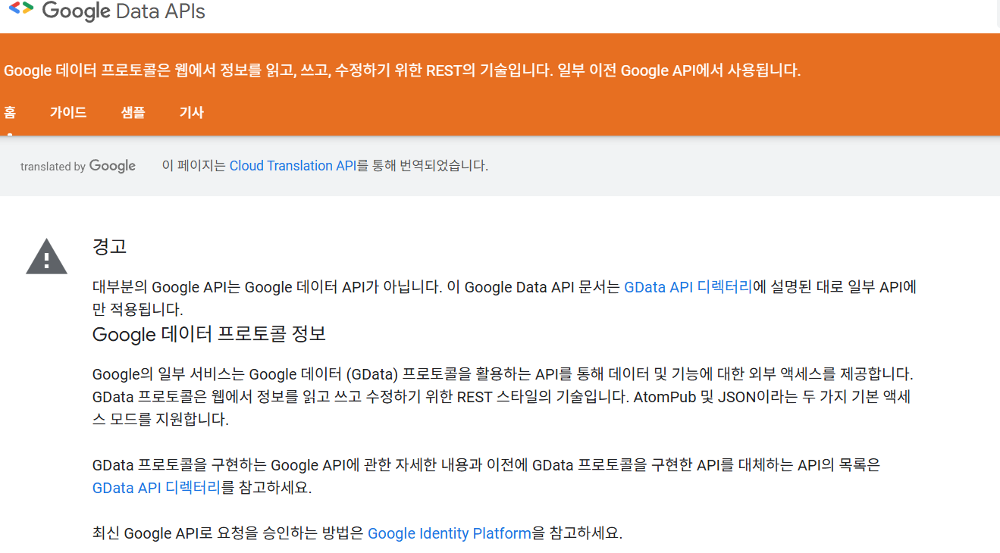
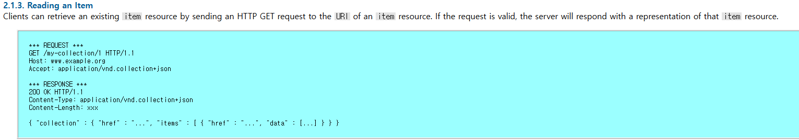

# 6장. 컬렉션 패턴
> 발표일 `24.11.26`
>
> 발표자 `공병규`

## 목차

1. Collection+JSON 요약
2. AtomPub 요약
3. 질문

## 1. Collection+JSON 개요

http://amundsen.com/media-types/collection/ 에서 설명된 내용 참고

- JSON 기반 하이퍼미디어 타입 (`application/x-www-form-urlencoded`, `text/plain` )
- IANA에 등록되어있음

### 컬렉션 리소스
- 3장에서 리소스의 정의 : '자기 url을 가질만큼 중요한 어떤 것'
- 컬렉션 리소스 : 리소스를 한 그룹으로 묶는 것
  - 컬렉션은 묶는 역할일 뿐, 각 리소스는 여전히 자기 url을 가짐
  - ex : 연락처 컬렉션에서 연락처의 아이템이 사람의 모든 정보를 가지고 있지는 않음

```
{ "collection" :
  {
    "version" : "1.0",
    "href" : "http://example.org/friends/",
    
    "links" : [
      {"rel" : "feed", "href" : "http://example.org/friends/rss"}
    ],
    
    "items" : [
      {
        "href" : "http://example.org/friends/jdoe",
        "data" : [
          {"name" : "full-name", "value" : "J. Doe", "prompt" : "Full Name"},
          {"name" : "email", "value" : "jdoe@example.org", "prompt" : "Email"}
        ],
        "links" : [
          {"rel" : "blog", "href" : "http://examples.org/blogs/jdoe", "prompt" : "Blog"},
          {"rel" : "avatar", "href" : "http://examples.org/images/jdoe", "prompt" : "Avatar", "render" : "image"}
        ]
      },
      
      {
        "href" : "http://example.org/friends/msmith",
        "data" : [
          {"name" : "full-name", "value" : "M. Smith", "prompt" : "Full Name"},
          {"name" : "email", "value" : "msmith@example.org", "prompt" : "Email"}
        ],
        "links" : [
          {"rel" : "blog", "href" : "http://examples.org/blogs/msmith", "prompt" : "Blog"},
          {"rel" : "avatar", "href" : "http://examples.org/images/msmith", "prompt" : "Avatar", "render" : "image"}
        ]
      }     
    ],
    
    "queries" : [
      {"rel" : "search", "href" : "http://example.org/friends/search", "prompt" : "Search",
        "data" : [
          {"name" : "search", "value" : ""}
        ]
      }
    ],
    
    "template" : {
      "data" : [
        {"name" : "full-name", "value" : "", "prompt" : "Full Name"},
        {"name" : "email", "value" : "", "prompt" : "Email"},
        {"name" : "blog", "value" : "", "prompt" : "Blog"},
        {"name" : "avatar", "value" : "", "prompt" : "Avatar"}
        
      ]
    }
  } 
}
```

- href : 컬렉션 자체의 링크
- links : 컬렉션에 관계된 리소스들의 링크
- items
  - `href`, `data`, `links`
  - href : 그 아이템의 URI (read/write가 가능할 수도 있음)
  - data : key-value 쌍과 프롬프트(선택사항)의 배열
- template : 새 항목 추가를 위한 하이퍼미디어 컨트롤
  ```
    POST /friends/
    Host : http://example.org/
    Content-Type: application/vnd.collection+json
    {
        "template":{
            "data":[
                {"name" : "full-name", "value" : "공병규", "prompt" : "Full Name"},
                {"name" : "email", "value" : "test@gmail.com", "prompt" : "Email"},
                {"name" : "blog", "value" : "blog.naver.com/faker", "prompt" : "Blog"},
                {"name" : "avatar", "value" : "http://myimage.png", "prompt" : "Avatar"}
            ]
        }
    }
  
- queries : 컬렉션 검색을 위한 하이퍼미디어 컨트롤
    ```
    {
        "queries" :
        [
            {
                "href" : "http://example.org/friends/search",
                "rel" : "search",
                "prompt" : "Enter search string",
                "data" :
                [
                    {"name" : "search", "value" : "테스트"}
                ]
            }
        ]
    }
    ```
## 2. AtomPub
- 2007년도에 개발된 글(뉴스, 블로그 등)의 배포를 위한 RSS 대체용 프로토콜
- 글의 수정과 게시를 표준화
- 최초의 컬렉션 패턴 표준
- 표현 포맷으로 `application/atom+xml`을 사용
- 현재는 거의 사용되지 않음
 
```
<?xml version="1.0" encoding="utf-8"?>

<feed xmlns="http://www.w3.org/2005/Atom">

	<title>Example Feed</title>
	<subtitle>A subtitle.</subtitle>
	<link href="http://example.org/feed/" rel="self" />
	<link href="http://example.org/" />
	<id>urn:uuid:60a76c80-d399-11d9-b91C-0003939e0af6</id>
	<updated>2003-12-13T18:30:02Z</updated>
	
	
	<entry>
		<title>Atom-Powered Robots Run Amok</title>
		<link href="http://example.org/2003/12/13/atom03" />
		<link rel="alternate" type="text/html" href="http://example.org/2003/12/13/atom03.html"/>
		<link rel="edit" href="http://example.org/2003/12/13/atom03/edit"/>
		<id>urn:uuid:1225c695-cfb8-4ebb-aaaa-80da344efa6a</id>
        <published>2003-11-09T17:23:02Z</published>
		<updated>2003-12-13T18:30:02Z</updated>
		<summary>Some text.</summary>
		<content type="xhtml">
			<div xmlns="http://www.w3.org/1999/xhtml">
				<p>This is the entry content.</p>
			</div>
		</content>
		<author>
			<name>John Doe</name>
			<email>johndoe@example.com</email>
		</author>
	</entry>

</feed>
```

### AtomPub을 사용하지 않는 이유
> 브라우저 내 API 클라이언트가 인기를 얻어갔고, 자바스크립트에서는 XML보다 JSON을 처리하는 것이 훨씬 쉽기 때문

교훈 : "표준에 문제가 없다"로는 충분하지 않고, 사람들이 필요로 하는지가 중요하다.

### 의미 체계의 문제

사람 대신에 컴퓨터가 어떤 버튼을 눌러야할지 결정하도록 하기

4장 : 일반적인 관점 - 링크와 tag(``, `<script>`)를 통해서 정보를 제공하자!

5장 : 도메인 특화 관점 - `rel` 을 통해서 도메인 특화 정보를 제공하자!

6장
- GET, PUT, DELETE를 item의 href에 쏴서 item 리소스를 수정
- GET, POST를 collection의 href에 쏴서 새 아이템 추가, 검색 수행
- 하지만 item의 data에 대해서는 정해진 규칙이 없음

## 3. 질문

### Q1.
> collection+JSON에 표준화된 오류 표현방식이 있나요? 있다면 어떤 것이 있을까요
>
> by 정예찬

### A1. 

```
{ "collection" :
  {
    "version" : "1.0",
    "href" : "http://example.org/friends/",
    
    "error" : {
      "title" : "Server Error",
      "code" : "X1C2",
      "message" : "The server have encountered an error, please wait and try again."
    }
  } 
}
```

옵셔널 오브젝트로 서버에서 발생한 가장 최근의 에러에 대한 정보를 담음

### Q2.

> AtomPub 도 일종의 기사 미디어 도메인에 특화 설계되었다고 볼 수 있나요? 만약 어느정도 복잡한 뉴스 기사 어플리케이션을 만든다고 할 때 (확장성 X) 이미 만들어진 AtomPub 프로토콜을 사용하는게 내가 JSON 기반 컬랙션 패턴을 정의해서 처음부터 시작하는 것보다 효율이 더 좋을지?
>
> by 이창준

### A2.

AtomPub은 RSS 대체용으로 개발된 프로토콜이기 때문에 기사 미디어 도메인에 특화설계된것이라고 볼 수 있을 것 같습니다.

뉴스 기사 애플리케이션을 게시용으로 사용한다 생각했을 때 이미 개발된 Atom 프로토콜에 맞춰서 개발하면 게시한 뉴스를 자동 수집하는 유저 입장에서 이미 알려진 프로토콜을 사용하기 때문에 편리할 것으로 예상됩니다. 

 하지만 단순히 브라우저를 이용해서 관심있는 글을 읽으려는 독자에게는 JSON 기반으로 백엔드-프론트엔드 통신을 구현하는게 더 효율적일 것 같습니다.

### Q3.

> AtomPub가 사용되지 않는 큰 이유가 xml형식이라서라고 하는데, 과거에 xml 표현이 많이 사용되었던 이유와 현재 JSON표현이 우세해진 이유와 과정이 궁금합니다.
>
> by 서지훈

### A3.

https://www.toptal.com/web/json-vs-xml-part-1

1990년대에 WEB 1.0과 1.1 시기에는 XML, XHTML(XML+HTML) 형식이 자주 쓰였음

2001년대에 JSON이 처음 개발 된 후 2005년 AJAX의 데이터 형식으로 포함되면서 급부상함

JSON의 장점들
- 메타데이터 적음
- 파싱이 빠르고 편리

### Q4.

> 6장에서 Collection + JSON의 응답 예시로 여러개의 아이템이 응답에 있는 경우를 들었습니다(P. 108 ~ 109 참고). 그렇다면 한 개의 아이템을 상세 조회하는 경우에는 응답이 어떤 형태로 오는 것일까요?
예를 들어 http://www.youtypeitwepostit.com/api/messages/1 주소로 GET 요청을 보내면 응답의 items 배열에 단 하나의 object가 들어가는 것일까요?
>
> by 박지환

### A4.

http://amundsen.com/media-types/collection/format/#read-write



맞습니다. 다만 항상 GET으로 가져올 수 있는 것이 보장되진 않습니다.
