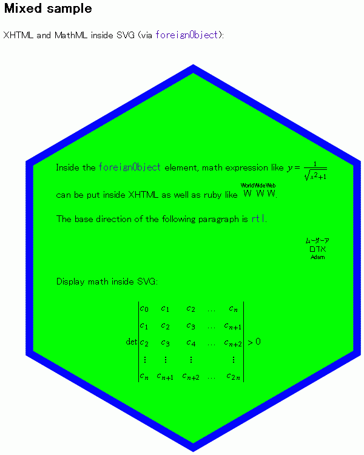

# 8. 프로파일

- API의 문서화: 문서의 양과 형식에 대한 고민
- 자기 서술형 메시지: 서버와 클라이언트는 각각 요청과 응답에 대해서 추측할게 아니라, 해당 메시지를 통해서 바로 의미를 파악 또는 유추 가능해야 함
  - Content-Type: 메시지의 body를 파싱 가능하도록 타입을 알려줌
    - application/json, text/html
  - 파싱을 해도 값 자체를 알수 있을 뿐 이게 어떤 의미를 가지는지는 파악 불가: 설명 없이는 그냥 JSON 객체일 뿐
  - 추가 정보가 필요
  - 프로파일이 추가 정보를 제공

## 프로파일이란?

- 프로파일의 정의([RFC 6096](https://datatracker.ietf.org/doc/html/rfc6906))
  > 프로파일은 리소스 표현 자체의 의미 체계를 변경하기 위함이 아니라 클라이언트에게 미디어 유형에 의해 정의된 의미 체계에 더해 그 리소스 표현에 연계된 추가적인 의미 체계를 알 수 있게 하기 위해 정의된다.
- 사람과 컴퓨터가 이해 가능하도록 리소스의 의미를 해설

## 프로파일 연결

- 주어진 문서에 어떤 프로파일이 연결되어 있는지를 명시

### Profile 연결 관계

- RFC 6906은 각 하이퍼미디어 컨트롤에서 프로파일에 연결하는 방식을 정의

  - HTML: `<a>`,`<link>`

    - 예시

      ```
      HTTP/1.1 200 OK
      Content-Type: text/html

      <html>
      	<head>
      		<link href="http://test.org" rel="profile">
      ```

  - Collection+JSON의 links 객체

### Profile 미디어 유형 매개 변수

- profile 값을 Content-Type의 미디어 유형에 추가
- 예시: `application/collection+json;profile="http://test.com"`
  - Content-Type 유형에 따라서 이런 형태를 지원하지 않을 수 있음
    - JSON 타입은 지원 X
    - Collection+JSON, JSON-LD, XHTML등은 지원

### 특수 목적 하이퍼미디어 컨트롤

- [HTML 마이크로데이터](../07-1/README.md#3-마이크로포맷-마이크로데이터)의 일부인 `itemtype`속성으로 프로파일에 연결
  - `itemtype`속성: 마이크로데이터가 어떤 의미인지 정의된 위치를 표시
  - `<div itemtype="http://1234.org"></div>`

## 프로파일의 역할

### 프로토콜 의미 체계 설명

- 사용자가 호출할 API에 대해서 풀어서 설명
  - 해당 API의 효과가 무엇인가

### 애플리케이션 의미 체계 설명

- 해당 API의 각 부분들이 어떤 역할을 가지고 어떤 작동을 하는가
  - 연결 관계
    - 이 연결을 활성화 했을 때(href를 실행했을 때) 발생할 상태 전이 설명
    - `<link rel="flip" href="/switches/4">`
  - 의미 체계 서술자
    - 해당 객체가 어떤 의미를 가지는지 설명
    - 동일한 의미 체계를 가지면 동일한 수준의 객체로 판별
    - 연결된 프로파일의 [카탈로그](https://microformats.org/profile/hcard)에서 해당 프로파일 이름을 검색
    - 예시
      - `<span itemprop="name">test</span>`
      - `{ "name" : "test" }`

[참고](https://www.w3.org/TR/html401/struct/global.html#h-7.4.4.3)

# 질문들

## Q1

> 프로파일 작성 시 유용한 도구 몇 가지를 장단점과 함께 소개해주세요

- 프로파일 작성은 보통 위키 형식 또는 스프레드시트 형식으로 많이 사용됨
- API 문서화 툴: OpenAPI Generator, Swagger 등
  - [OpenAPI Generator](https://openapi-generator.tech/):
    - 무료
    - 표준화 잘 되어있음 -> OpenAPI로 만들어진 문서를 통해 다른 도구들도 이용 가능
    - HTML이나 [cwiki](https://infra.apache.org/cwiki.html) 문서로 변환 가능
  - [Swagger](https://swagger.io/):
    - 사용자 한명까지만 무료
    - 다양한 기능 포함
    - Swagger UI: 각 API가 어떤 작업을 하는지 한눈에 파악 쉬움
      - 화려함
    - Swagger Editor: 오픈소스 API 에디터

## Q2

> [링크](https://github.com/ahnlabcloudmatelabs/jsonld-helper-ts?tab=readme-ov-file#why-use-this-library) 에 나와있는 것처럼 <br>
> JSON-LD에는 엄격한 문법 제한이 없어 불편을 겪을 수도 있어보이는데 <br>
> XMDP, ALPS, JSON-LD 같은 프로파일을 사용할 때 쉽게 발생하는 문제나 주의해야 할 점이 있을까요?

[참고](https://egonw.github.io/cookbook-dev/content/recipes/interoperability/creating-minimal-metadata-profiles.html)

## Q3

> 프로파일을 연결했을때 기계가 어떻게 자동으로 의미를 해석할 수 있는지 자세히 설명해주세요

- 기계가 온전히 의미를 해석한다기 보단 데이터의 어느 부분이 어떤 마이크로포맷으로 구성되어있는지 확인하는 작업 진행
- hCard 마이크로포맷에서 특수한 의미를 지니는 class 값이 문서에 존재할 때 기계는 프로파일을 통해서 해당 클래스가 hcard의 클래스이고 해당 부분이 hCard 기반으로 이루어져있다는 것을 확인
- [사람이 보는 API 문서](https://microformats.org/wiki/hcard)
- [기계가 보는 API 문서](https://microformats.org/profile/hcard)

## Q4

> HTML4는 head 태그에 profile을 사용했는데, <br>
> HTML5는 Link에 rel="profile"과 같이 사용하게 된 이유가 따로 있을까요?

- 웹 API의 초창기라 프로파일 개념이 잘 사용되지 않음 -> HTML5로 올라갈때 [폐기](https://html.spec.whatwg.org/multipage/obsolete.html#attr-head-profile)
- HEAD의 profile 속성 하나로 문서의 모든 프로파일 연결이 제한됨
  - `<link>` 또는 `<a>`를 사용했을 때 해당 태그에서 연결된 프로파일은 해당 태그의 자식들에게만 적용 -> 모듈화
- `<a rel="profile" href="http://microformats.org/profile/hcard">hCard</a>` 이러한 형태로 HEAD에 있던 시절과는 다르게 사용자에게 실제 사이트에서 가시적으로 보여줄 수 있음
- [참고](https://microformats.org/wiki/rel-profile#advantages)

## Q5

> XMDP를 기술하는 html과 xhtml의 차이를 설명해주세요 <br>
> html에서는 가능하지만 xhtml에서는 불가능한 혹은 그 반대의 경우를 설명해주세요

- HTML과 XHTML 모두 마크업 언어로 XHTML이 HTML에 비해 더 규칙이 엄격하고 표준화 되어있음
  - HTML: `<br>, `
  - XHTML: `<br />, `
- 자바스크립트를 사용해 DOM을 조작할때 차이 존재
  - `document.body.tagName`
    - HTML: `BODY`
    - XHTML: `body`
- 문서를 읽다가 오류가 발생했을 경우(문법 오류 등)
  - HTML: 자체적으로 오류를 수정해서 보여주거나 해당 부분만 망가지고 나머지 부분들은 제대로 렌더링 됨
  - XHTML: 오류 메시지를 띄우고 페이지 렌더링 중단
- [XHTML은 MathML이나 SVG같은 다른 XML 형식들을 문서에 포함시킬 수 있음](https://www.w3.org/TR/XHTMLplusMathMLplusSVG/)

  
