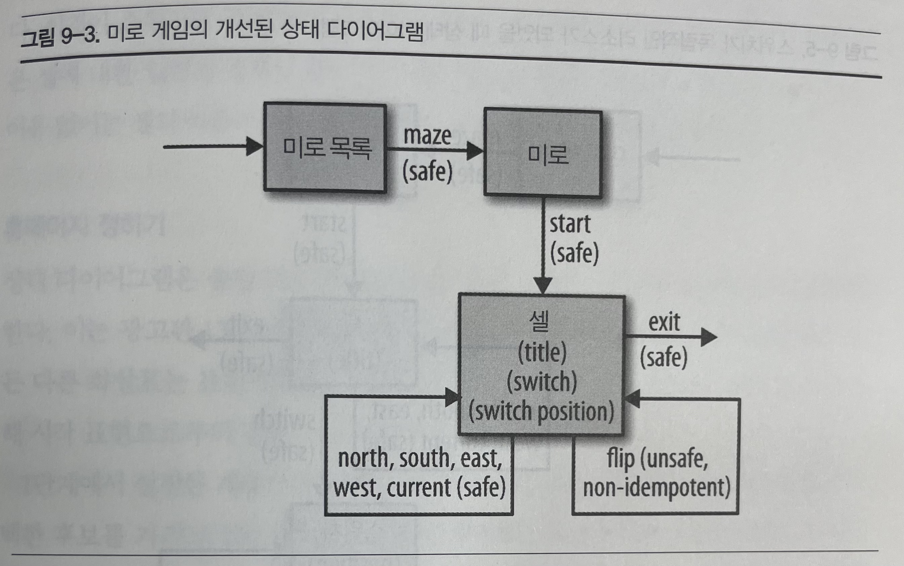
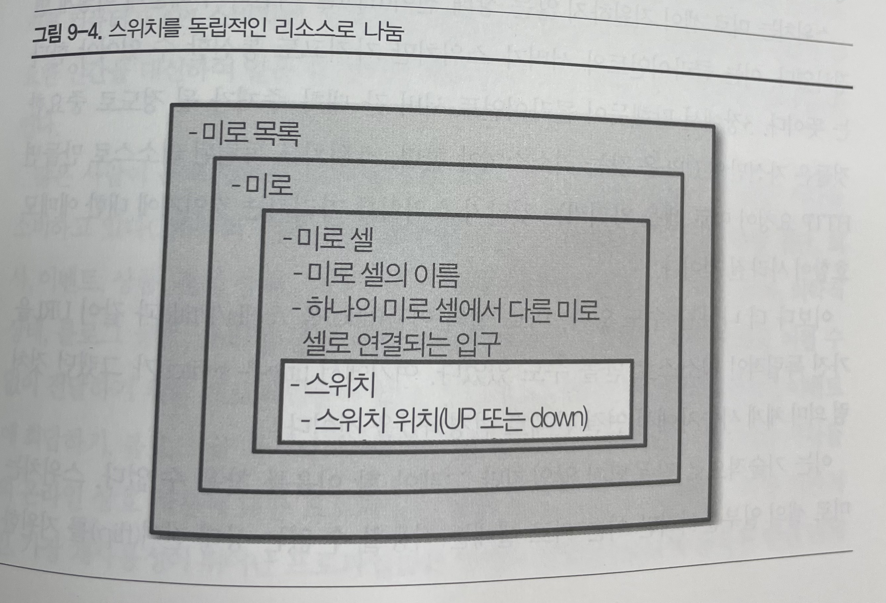
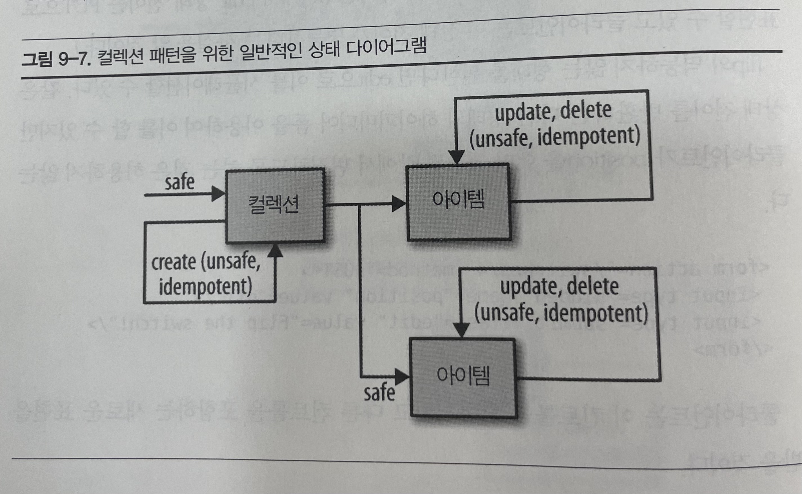
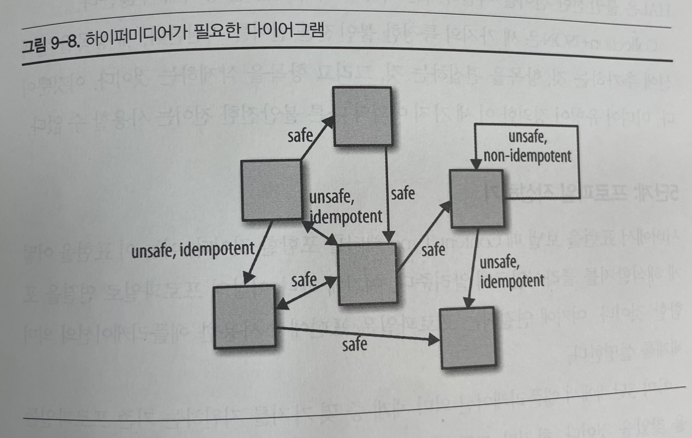
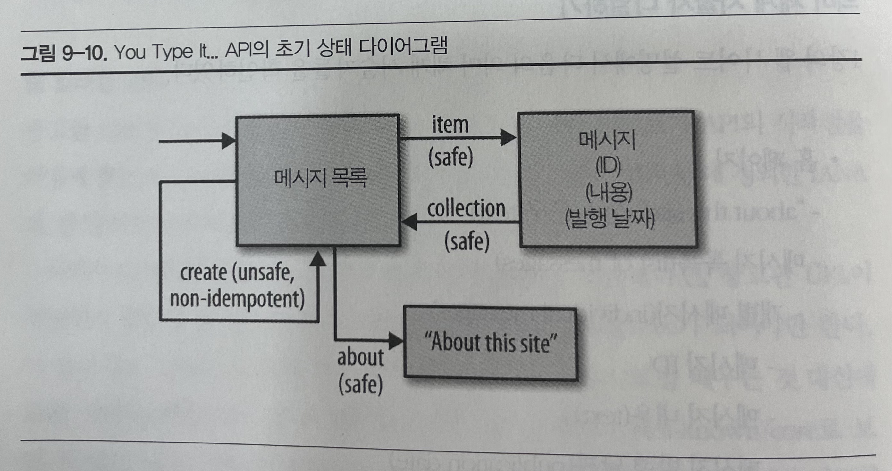
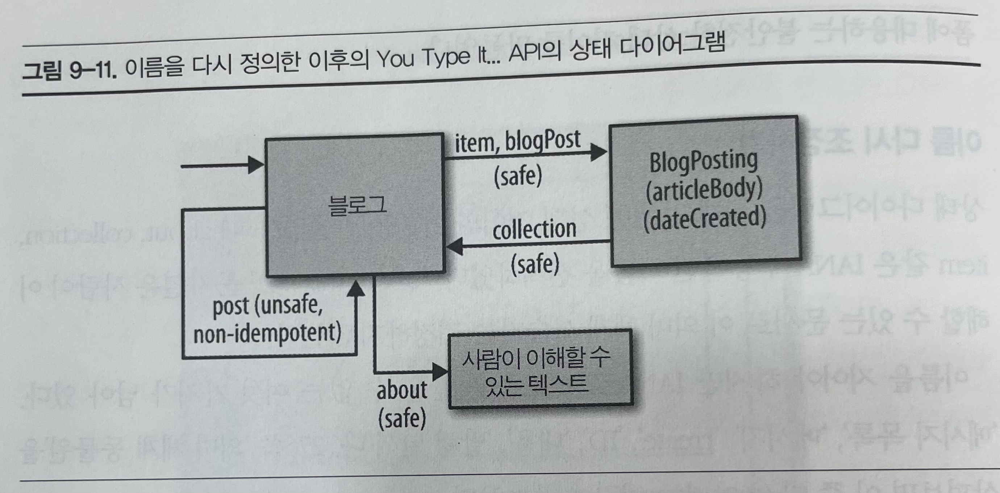

# 9장 설계 절차

## 목차

1. 2단계 설계 절차
2. 7단계 설계 절차
3. 예제: You Type it, We Post it
4. 질문

- 이번 장에서는 비즈니스 요구 사항에서 시작하여 몇가지 소프트웨어와 사람이 이해할 수 있는 문서로 마무리하는 절차를 계획할 것이다.

## 1. 2단계 설계 절차

프로토콜의 의미 체계: HTTP 프로토콜 하에서 API 행동 양식
어플리케이션 의미 체계: 표현이 참조할 수 있는 실제 세계의 것들

- 1. 표현에 사용할 미디어 유형을 선택한다 <- 프로토콜과 어플리케이션의 의미 체계에 제약 사항들을 결정
- 2. 그 외 모든 것을 다루는 프로파일을 작성한다

-> 이렇게 하지 말라

## 2. 7단계 설계 절차

1. 의미 체계 서술자 나열하기

- 클라이언트가 얻길 원하는 모든 정보를 열거하는 단계

2. 상태 다이어그램 그리기

- 안정성과 멱등성을 주시하여 상태 전이를 표현할 것.
- 의미 체계 서술자는 연결 관계가 될 수도 있다.
  -> 의미 체계 서술자가 연결 관계면 연결 관계로 풀어서 써라.
  -> 상태 전이별로 객체를 다시 설계한다.
  -> 의미 체계 서술자를 다시 나열해본다.
  -> 개선된 의미 체계 서술자로 다시 상태 다이어그램을 그린다.
  -> 위 과정을 만족할 때까지 반복.
- 상태 다이어그램은 출발점이 없는 하나의 화살표를 포함해야한다 (홈페이지)







3. 이름 조정하기

- "엄밀히 말하면 이 단계는 건너뛰어도 된다."
- 재사용성이 뛰어난 프로파일들 (무리에 참여하기, 블로그 글 작성하기, 등등의 상호 작용) IANA를 참조해서 이름을 지어라
- [FOAF](http://xmlns.com/foaf/spec/)
- [FOAF를 이용해서 의미 체계 정의하기](https://stackoverflow.com/questions/66162579/how-to-specify-a-class-property-using-foaf)
- 최소한의 충고 두가지:
  - 데이터베이스 스키마나 객체 모델에 있는 항목을 이용하여 의미 체계 서술자 이름을 자동으로 생성하지 않도록 한다.
  - IANA에 등록된 연결 관계의 기능과 종북되는 연결 관계를 만들지 않도록 한다.
    - 예시:
      - 어떤 것들의 목록과 그들의 개별 항목 사이 관계가 존재하는 상황이라면, 더 구체적인 무언가를 만드는 것 대신 IANA 에 등록된 연결 관계인 collection 과 item 사용을 고려해 본다.
      - 리소스 상태 표현 > fist, last, next, previous || [RFC5005](https://www.rfc-editor.org/info/rfc5005)
      - 메시지 스레드 > [RFC4685](https://www.ietf.org/rfc/rfc4685.txt)
      - 리소스 상태 버전 관리 > [RFC5829](https://datatracker.ietf.org/doc/html/rfc5829)
      - 리소스 상태만을 변경 -> edit


4. 미디어 유형 선택하기

- 컬렉션 패턴 유형 선택



Collection+JSON, AtomPub, 또는 OData 사용을 고려

- 하이퍼미디어 유형 선택



- HTML, HAL, 사이렌 선택

-> JSON 은 하이퍼미디어 유형이 아니다. 연결관계 설명이 가능한 위 옵션들을 우선적으로 고민해보도록 하자.
-> API 가 읽기 전용이라면(안전한 상태 전이) - HTML, HAL, JSON-LD 등을 추천
-> API 가 불안전한 상태 전이를 포함 - 히드라를 추가해야한다 (12장 참조)

5. 프로파일 작성하기

```html
<link rel="profile" href="http://alps.io/example/maze" />
<link rel="profile" href="/switches.alps" />
```

- 서버가 Content-Type 해더를 통해 클라이언트에게 미디어 유형을 알려준다. - 하나 이상의 프로파일로 연결을 포함할 것
- 프로파일
  -> 프로파일은 ALPS 문서나 JSON-LD 콘텍스트, 또는 XMDP 마이크로포멧을 사용하는 웹 페이지가 될 수도 있다.
  -> 이것들 중 적절한 것이 없다면 컴퓨터가 이해할 수 있는 프로파일을 포기하고 대신 사람이 이해할 수 있는 프로파일을 작성.

6. 구현하기

- 충고없음

7. 게시하기

- 광고판 URL 게시하기
  -> 홈페이지 설정 - 모든 다른 리소스로 연결이 되는지 확인 필요

- 프로파일 게시하기
  -> 프로파일 문서는 API에 대한 나머지 정보와 함께 웹 사이트에 올린다

- 새로운 미디어 유형 등록하기
  -> 아마도 거의 없다. 자세한 내용은 p.219

- 새로운 연결 관계 등록하기
  -> 연결 관계가 확장 연결 유형이면 할 일 없음 [RFC5988](https://www.rfc-editor.org/rfc/rfc5988.html)
  -> 연결 관계 등록방법

  - IANA에서 찾기 예시: [RFC4685](https://www.ietf.org/rfc/rfc4685.txt)
  - 연결 관계를 미디어 유형과 함께 정의
  - 프로파일에 정의
  - [마이크로포멧 위키 참고](https://microformats.org/wiki/existing-rel-values)

- 문서의 나머지 게시하기
  -> API에 대한 요약, 예제들, 예제 코드, 인증에 필요한 환경 설정 방법, 마케팅 문구 등등

- 잘 알려진 URI
  -> CoRE 클라이언트

## 예제: You Type it, We Post it

- 의미 체계 서술자 나열하기


- 상태 다이어그렘 그리기



- 이름 다시 조정하기

  - about, collection, item 같은 IANA에 등록된 이름을 선택
  - 메시지, 내용, 발행 날짜 -> [BlogPosting](http://schema.org/BlogPosting) 이라는 마이크로데이터 참조 - articleBody, dateCreated
  - create -> 엑티비티 스트림즈 표준 참조 - post
  - 메시지 ID -> 제거



- 미디어 유형 선택하기

  - 다양성을 위해 HAL 을 선택

  ```xml
  <resource href="/" />
    <link rel="profile" href="http://alps.io/schema.org/Blog">
    <link rel="profile" href="http://alps.io/schema.org/BlogPost">
    <link rel="profile" href="http://alps.io/activitystrea.ms/verbs">
    <link rel="about" href="/about-this-site">

    <Blog>
      <link rel="post" href="/messages" />

      <resource href="/messages/2" rel="item">
        <BlogPost>
          <articleBody>This is message #2</articleBody>
          <dateCreated>2014-01-01</dateCreated>
        </BlogPost>
      </resource>

      <resource href="/messages/1" rel="item">
        <BlogPost>
          <articleBody>This is message #1</articleBody>
          <dateCreated>2014-01-01</dateCreated>
        </BlogPost>
      </resource>
    </Blog>
  </resource>
  ```

- 프로파일 작성하기

  - 모든 애플리케이션 의미 체계를 기존 프로파일에서 가져왔기에 추가 작업 필요없음
  - 책 p.212 에 새로 ALPS 프로파일 등록해서 사용한 예시가 있음.

## 질문

### Q1.

> 정예찬
>
> 홈페이지 리소스 설계는 어떤 점을 특별히 신경써야 할까요?
> 홈페이지 리소스를 설계하지 않거나 적절히 하지 못한 경우 어떤 문제가 있을까요?

### A1.

홈페이지는 모든 다른 리소스에 대한 게이트웨이로, 홈페이지를 통해 다른 모든 리소스를 접근 할 수 있는지 확인해야 한다.
2단계 설계 절차에서 설계해야 하며, 잘못 설계된 경우 클라이언트 입장에서 서버에 존재하는 리소스를 찾을 수 없게 된다.

### Q2.

### Q3.

### Q4.

### Q5.
