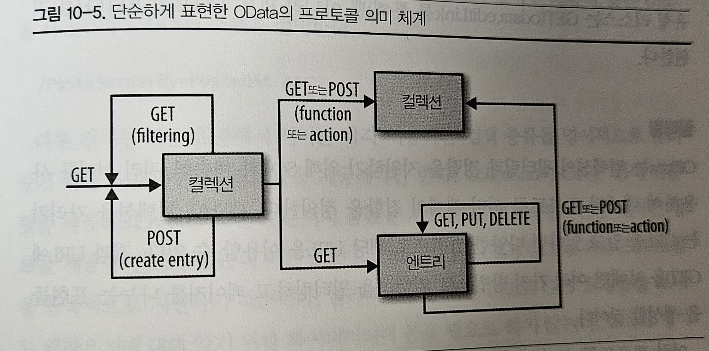
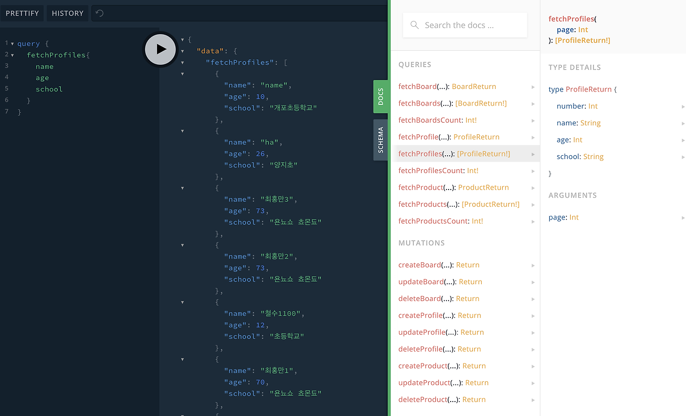

# 10장. 하이퍼미디어 동물원 (~ 순수 하이퍼미디어 유형)
> 발표일 `24.12.24`
>
> 발표자 `공병규`

## 목차

1. 개요
2. OData
3. 질문

## 개요

- 다양한 하이퍼미디어를 소개
  - 도메인 특화 형식
  - 컬렉션 패턴
  - 일반적인 하이퍼미디어

### 도메인 특화 하이퍼미디어
- 특정 도메인의 의미체계를 설명하기 위해 디자인
- 다른 의미 체계를 표현할 때 써서는 안됨
- Maze+XML, OpenSearch, 문제 상세 문서, SVG, VoiceXML

### 컬렉션 리소스
- Collection+JSON, AtomPub, Odata

### 순수 하이퍼미디어 유형
- html, HAL, Siren, WADL 등등..

### OData
- content-type : application/jsopn;odata=fullmetadata
- http://www.odata.org/docs
- json, xml 모두 사용



```
{
    "odata.metadata": "http://api.example.com/YouTypeItWePostIt.svc/$metadata#Posts",
    "value": [
        {
            "Content": "This is the second post.",
            "Id": 2,
            "PostedAt": "2013-04-30T03:34:12.0992416-05:00",
            "PostedAt@odata.type": "Edm.DateTimeOffset",
            "PostedBy@odata.navigationLinkUrl": "Posts(2)/PostedBy",
            "odata.editLink": "Posts(2)",
            "odata.id": "http://api.example.com/YouTypeItWePostIt.svc/Posts(2)",
            "odata.type": "YouTypeItWePostIt.Post"
        },
        {
            "Content": "This is the first post",
            "Id": 1,
            "PostedAt": "2013-04-30T04:14:53.0992416-05:00",
            "PostedAt@odata.type": "Edm.DateTimeOffset",
            "PostedBy@odata.navigationLinkUrl": "Posts(1)/PostedBy",
            "odata.editLink": "Posts(1)",
            "odata.id": "http://api.example.com/YouTypeItWePostIt.svc/Posts(1)",
            "odata.type": "YouTypeItWePostIt.Post"
        },
        "#Posts.RandomPostForDate": {
            "title": "Get a random post for the given date",
            "target": "Posts/RandomPostForDate"
        }
    ]
}
```
- GET Posts 컬렉션의 응답 예시
- `odata.id` : 각 리소스의 고유 URI
- `odata.type` : 프로퍼티의 의미 유형 정보
- `odata.editLink` : atomPub의 'rel=edit' 처럼 각 리소스를 편집할 수 있는 링크
- `odata.navigationLinkUrl` : 다른 리소스로의 하이퍼미디어 연결

#### 필터링
- SQL 처럼 쿼리 언어를 지원
- 컬렉션의 url만 알면 다양한 방법으로 쿼리를 보낼 수 있음
- 컬렉션 링크가 `/Posts` 일 때
  - `/Posts$filter=substringof('second', Content) + and + PostedBy/Username eq 'alice'`
  - Content가 'second'를 포함하고 작성자의 이름이 'alice'인 글
- 필터링, 정렬 기능 존재

#### 메타데이터 문서
- `odata.metadata` 에서 명시된 링크로 메타데이터 문서를 볼 수 있음
```
"#Posts.RandomPostForDate": {
 "title": "Get a random post for the given date",
 "target": "Posts/RandomPostForDate"
 },
```

```
<FunctionImport Name="RandomPostforDate" EntitySet="Posts"
 IsBindable="true" m:IsAlwaysBindable="false"
 ReturnType="Post" IsSideEffecting="false">
 <Parameter Name="date" Type="Edm.DateTime" Mode="In" />
</FunctionImport>
```
- CSDL (Odata 고유의 스키마 설명 형식)에 맞게 함수의 정보, 리소스 정보를 설명
- `application/jsopn;odata=fullmetadata` 대신 `application/jsopn;odata=minimalmetadata`를 써서 odata 관련 프로퍼티는 생략하고 metadata 링크만 남겨서 프로파일처럼 쓸 수 있음


## 질문

### Q1.
> OData의 엔트리 데이트 모델에 정의되어 있는 날짜 형식에 대해 공유해주세요 p.255
>
> by 이창준

### A1. 

https://www.odata.org/documentation/odata-version-3-0/common-schema-definition-language-csdl/

https://learn.microsoft.com/en-us/dotnet/framework/data/adonet/entity-data-model-primitive-data-types

### Q2.

> 특정 미디어 유형의 프로토콜 의미 체계를 어떻게(어디서) 확인할 수 있을까요? 예시를 통해 프로토콜 의미 체계를 찾는 법을 보여주시면 좋을 것 같습니다.
>
> by 박지환

### A2.

그 미디어 유형의 공식 문서를 안다면 그 문서를 참조

https://www.iana.org/assignments/media-types/media-types.xhtml

### Q3.

> OData 와 같은 기능(비슷한)을 수행하는 미디어 유형들을 소개해주고, 특징과 차이점을 비교해주세요.
>
> by 정시우

### A3.

Odata의 가장 큰 특징은 컽렉션 리소스에 대해서 각 필드를 설명하면서 필터링, 정렬이 가능한 쿼리를 제공한다는 것

가장 유사한 미디어 타입으로는 graphQL이 있다.

- 리소스를 가져올 때 스키마 문서를 직접 보고 원하는 프로퍼티들을 골라서 리소스 여러개를 한번에 가져오는게 가능
- 페이스북에서 개발되어 많은 사용자를 확보하고 있음
- 강력한 타입 시스템을 지원 (primitive, object type, list, non-null, enum)
- playground를 제공하여 시각화, 디버깅 면에서도 이점



https://api.nudge-community.cc/graphql

https://graphql.org/learn/schema/

