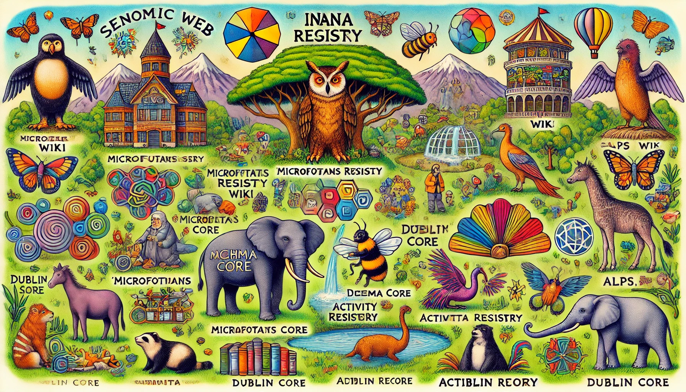

# 10장. 하이퍼미디어 동물원 (GeoJSON: 문제가 되는 유형 ~)

## 목차

1. GeoJSON (문제가 되는 유형의 하이퍼미디어)
2. 의미 체계 동물원
3. 질문

## 1. GeoJSON (문제가 되는 유형의 하이퍼미디어)

GeoJSON: JSON 기반으로 지리적 기능들을 표현하기 위해 설계 (https://geojson.org/)

``` JSON
{
    "type": "FeatureCollection",
    "features": [
        {
            "type": "Feature", // 지도 위 하나의 포인트
            "geometry": {
                "type": "Point",
                "coordinates": [
                    13.175266,
                    32.897586
                ]
            },
            "properties": { // 사람이 이해할 수 있는 속성들
                "title": "Oea",
                "awmc_id": "141999",
                "awmc_link": "http://awmc.unc.edu/api/omnia/141999",
                "pid": "344456",
                "pleiades_link": "http://pleiades.stoa.org/places/344456",
                "type": "settlement",
                "mindate": "-750",
                "maxdate": "640",
                "description": "An ancient place, cited: BAtlas 35 F2 Oea"
            },
            "id": 0
        }
    ]
}
```

### 문제점

- GeoJSON은 일반적인 하이퍼미디어 컨트롤이 없다

    awmc_link, pleiades_link - 하이퍼미디어 연결처럼 보이지만 단순한 문자열에 불과 => AWMC API를 위한 클라이언트 작성 필요

    - 하지만 GeoJSON은 하이퍼미디어 컨트롤을 정의했다

    ``` JSON
    {
        "type": "FeatureCollection",
        "features": [
            {
                "type": "Feature", // 지도 위 하나의 포인트
                "geometry": {
                    "type": "Point",
                    "coordinates": [
                        60000,
                        70000
                    ]
                },
                "crs": {
                    "type": "link",
                    "properties": {
                        "href": "http://example.org/mygrid.wkt",
                        "type": "esriwkt"
                    }
                }
            }
        ]
    }
    ```
    좌표 대신 http://example.org/mygrid.wkt 에 있는 리소스에서 정의된 커스텀 CRS(Coordinate Reference System)을 사용한다.

- GeoJSON만의 미디어 유형이 없다

    GeoJSON의 미디어 유형: application/json => 어떻게 클라이언트가 GeoJSON과 일반 JSON을 구별할 수 있을까?

    해결책 1. 서버가 GeoJSON을 JSON 프로파일로 취급 \
        `Link: <http://www.geojson.org/geojson-spec.html>;rel="profile"`

    해결책 2. GeoJSON을 위한 ALPS 프로파일이나 JSON-LD 콘텍스트를 작성 \
        `Link: <http://example.com/geojson.jsonld>;rel="http://www.w3.org/ns/json-ld#context"`

    둘 중 하나라도 지원하는 GeoJSON 구현은 없다.

GeoJSON이 하이퍼미디어 컨트롤과 특별한 미디어 유형이 없어서 문제가 되지는 않지만,
같은 appplication/json을 사용하는 다른 하이퍼미디어와 함께 사용한다면, 클라이언트에게 큰 혼동을 줄 수 있다.


## 2. 의미 체계 동물원


애플리케이션 의미 체계의 프로파일들을 제공하는 등록 기관들에 대해 알아보자

### 연결 관계의 IANA 등록부

- **미디어 유형: 모든 것**
- 사이트: [IANA 페이지](https://www.iana.org/assignments/link-relations/link-relations.xhtml)
- 의미 체계: 일반적인 탐색

### 마이크로포맷 위키

- 미디어 유형: HTML
- 사이트: [마이크로포맷 페이지](https://microformats.org/wiki/Main_Page)
- **의미 체계: 사람이 온라인에서 검색하길 원하는 내용들에 관한 것**

### 마이크로포맷 위키의 연결 관계

- 미디어 유형: HTML
- 사이트: [마이크로포맷 페이지](https://microformats.org/wiki/existing-rel-values)
- 의미 체계: 매우 다양함

IANA와 달리 광범위하게 모든 연결 관계를 등록했기 때문에 여기서 연결 관계를 고르고 사용하는 것은 추천하지 않는다.

### schema.org

- 매체: HTML5, RDF
- 사이트: http://schema.org
- 의미 체계: 사람이 온라인에서 검색하길 원하는 내용들에 관한 것

먾은 schema.org의 마이크로데이터 프로퍼티들과 마이크로포맷들이 서로 겹친다.
대신 schema.org는 소비자에게 초점이 맞춰져 있다.

### 더블린 코어

- 매체: HTML, XML, RDF, 일반 텍스트
- 사이트: [더블린 코어 홈페이지](https://librarian.nl.go.kr/LI/contents/L10201000000.do)
- **의미 체계: 출판 작업물**

### 액티비티 스트림즈

- 매체: 아톰, JSON
- 사이트: [액티비티 스트림즈 홈페이지](https://activitystrea.ms/)
- **의미 체계: 사람들이 온라인에서 행하는 것들**

액티비티 스트림즈와 schema.org의 마이크로데이터 프로퍼티들 사이에도 겹치는 게 많다.

### ALPS 등록부

- 사이트: http://alps.io/

[다른 곳들의 항목들을 ALPS 버전](https://github.com/alps-io/imports)으로 만들고 있고 많이들 이용해주면 좋겠다.

## 3. 질문

### Q1.
> 박근영 \
> 프로파일 등록 기관마다 프로파일 변경 등에 대한 공지 채널이 있나요?

### A1. 

https://github.com/protocol-registries/link-relations

https://microformats.org/wiki/to-do, https://microformats.org/wiki/irc

https://schema.org/docs/releases.html

https://www.dublincore.org/specifications/dublin-core/dcmi-terms/release_history/

https://github.com/activitystreams

https://datatracker.ietf.org/doc/draft-amundsen-richardson-foster-alps/

### Q2.
> 곽재영 \
> alps.io 에서 ALPS 프로파일을 등록하고, 등록된 프로파일을 참조하는 방법이 궁금합니다.

### A2. 

https://github.com/alps-io/profiles - To add to this collection just clone the repo, add your profile, and send a PR.

http://alps.io/spec/alps-to-html/#_advertising_alps_profiles_for_html_representations


### Q3.
> 서형석 \
> 애플리케이션 의미 체계의 프로파일들을 제공하는 등록 기관들은 지금도 게속 쓰이고 있나요? 그 중에 마치 DNS와 같이 전 세계에서 dominant하게 등록해야만 사용할 수 있는 곳들은 어떤 곳들이 있나요?

### A3. 

웹 사이트에 접근 가능하다는 측면에서는 계속 쓰이고 있음. \
IANA가 일반적인 공식 등록 기관, 다만 각 도메인이나 의미 체계에 맞게 프로파일을 골라서 사용
