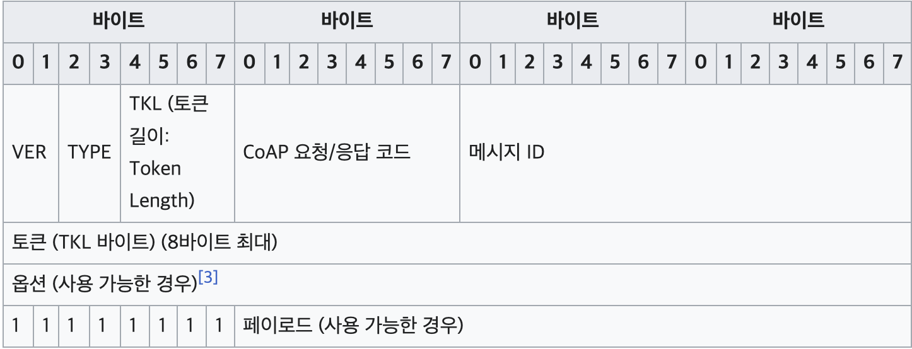
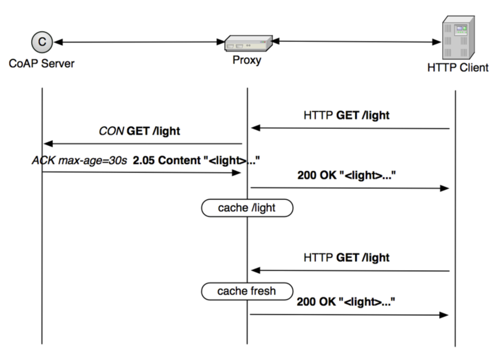
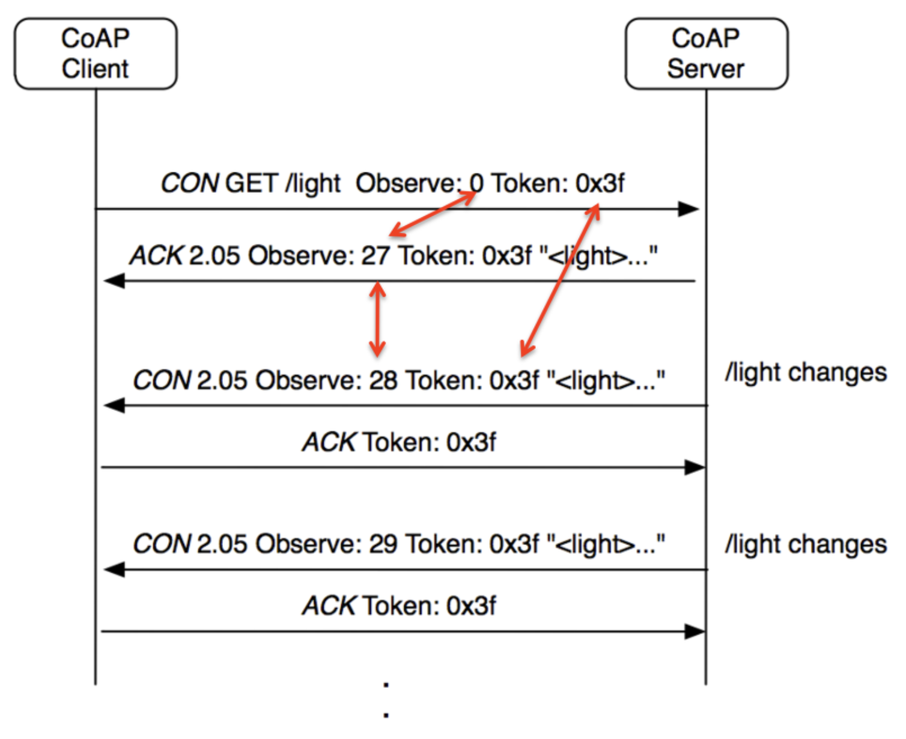
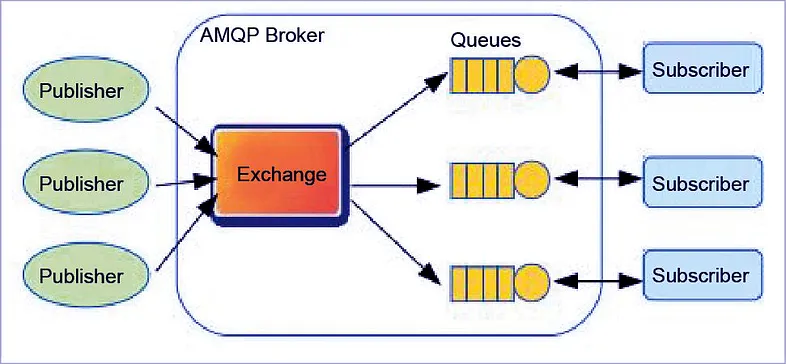

# 13. CoAP: 임베디드 시스템을 위한 REST

발표자: 최준영

## Introduction

- Constrained Application Protocol
- 저전력, 저사양 디바이스 환경에서 동작하는 통신 프로토콜
  - 전력이 연결된 환경 외에 물리적으로 제한된 환경에서 배터리, 에너지 하베스트 등을 활용해 동작
  - 소형 디바이스
  - 모든 기기에 값비싼 CPU나 AP 칩을 탑재할 수 없다! ( 평균적인 고객들은 적당한 성능과 적당한 가격에 만족한다 )
  - 이러한 제약 환경에서 무리없이 동작할 수 있는 네트워크 프로토콜로 사용
- UDP 기반에서 동작
  - 서버 - 클라이언트 간 연결 없음

## Message Type



- CON
  - ACK 받을 때까지 계속 보냄
- NON
  - ACK 필요없음 (GET 같은 안전한 요청)
- ACK
  - 이전 메시지를 처리했다는 응답
- RST
  - 이전 메시지를 처리하지 못했다는 응답

## 유사 RDT...?

- 타이머 관리
- 재전송

요청을 보낸 지 일정 시간 내에 ACK 응답을 받지 못하면 요청 재전송

MID (message id) 필드를 이용해 req - ack 페어 특정

토큰을 이용해 MID가 중복된 각 메시지들을 구별 가능

> 효율이 떨어지지만 유사 RDT 달성

## 더보기

### 캐시 & 프록시

**매번 종단 노드까지 가지 않는다**



### Observation

**event 방식**



# 질문

> 이창준
> IoT 가 왜 저사양 네트워크로 통신을 하는지 궁금합니다. 단순하게 가정집 와이파이 같은걸 사용하면 네트워크 환경이 열악하지 않을거 같은데 이렇게 설계된 이유가 궁금합니다 p.347

> 정예찬
> CoAP 는 UDP를 사용하는데, 신뢰성이 보장되나요? CoAP에 보안에 관련된 기능이 있나요?

**DTLS**

- 손실된 패킷 재전송
  - 타임아웃
- 패킷 순서 보장, 무결성 검증
  - 시퀀싱
- TLS와 동일한 암호화 및 인증 기능 제공

```
클라이언트                              서버
    |   -----> ClientHello  ----->   |
    |   <---- HelloVerifyRequest ---- |
    |   -----> ClientHello (Cookie 포함) ----->   |
    |   <---- ServerHello ---- |
    |   <---- Certificate ---- |
    |   <---- ServerKeyExchange ---- |
    |   -----> ClientKeyExchange -----> |
    |   -----> ChangeCipherSpec -----> |
    |   -----> Finished -----> |
    |   <---- ChangeCipherSpec ---- |
    |   <---- Finished ---- |
  (보안 연결 수립 및 암호화된 데이터 전송 시작)
```

1. ClientHello

   - DTLS 연결 요청

2. HelloVerifyRequest
   - 바로 응답 x
   - DDoS 방지를 위해 실제 요청인지 확인 필요
   - 서버가 생성한 쿠키와 함께 확인 메시지 요청
3. ClientHello
   - 서버로부터 받은 쿠키와 함꼐 요청 재전송

... 인증서 / 키 교환 등...

> 정시우
> 복잡한 IoT 시스템에서는 CoAP 같은 프로토콜은 한계점이 있을 것 같은데, 대체하는 기술에 대해서 소개해주세요.

단순한 하드웨어 및 환경적 제약으로 인해 HTTP -> CoAP로 갔는데 하드웨어와 시스템이 복잡해지고 한계가 생겼다?
CoAP -> HTTP로 다시 가면 됨

**MQTT**

Message Queue Telemetry Transport


**AMQP**

Advanced Message Queuing Protocol


> 공병규
> 최근 CoAP 프로토콜이 DDoS 공격 대상이 되고 있다고 하는데, 그 이유가 무엇인지 소개해주세요.

https://jaime.win/lecture/coapddos.html

1. UDP 기반
   서버-클라이언트 간 연결이 필요없음
   ip spoofing 쉬움
2. 멀티 캐스트 기능 남용
3. Observe 기능 남용
