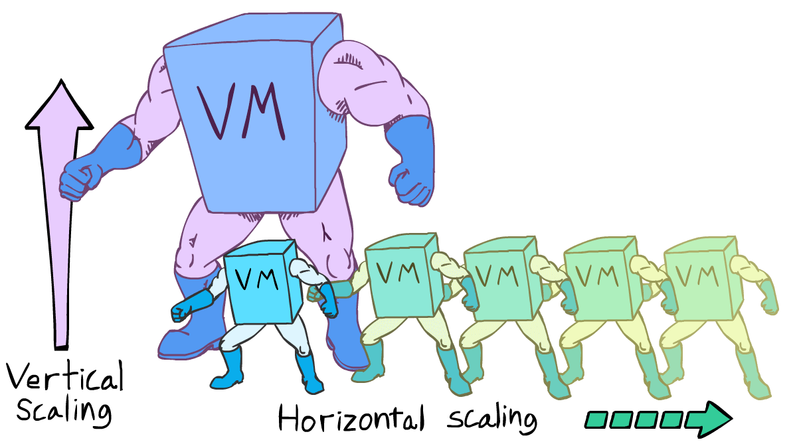
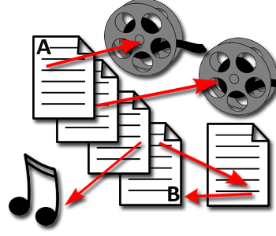
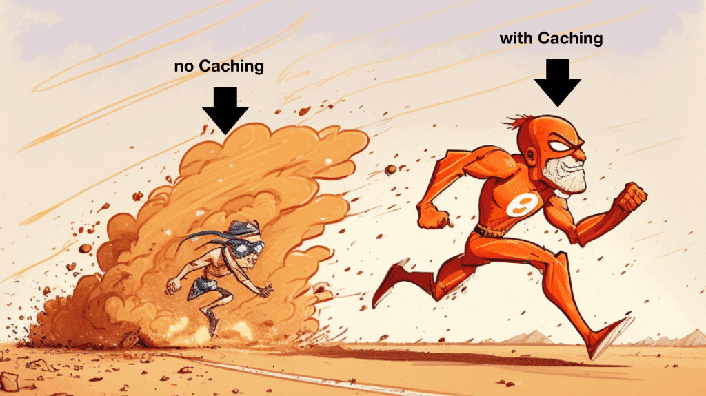
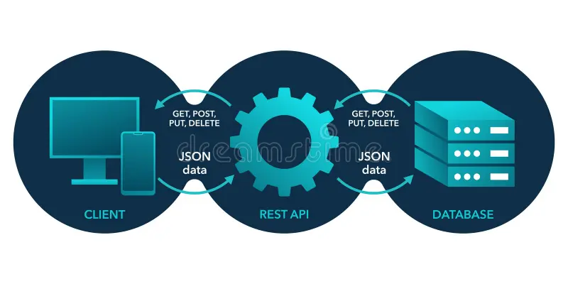
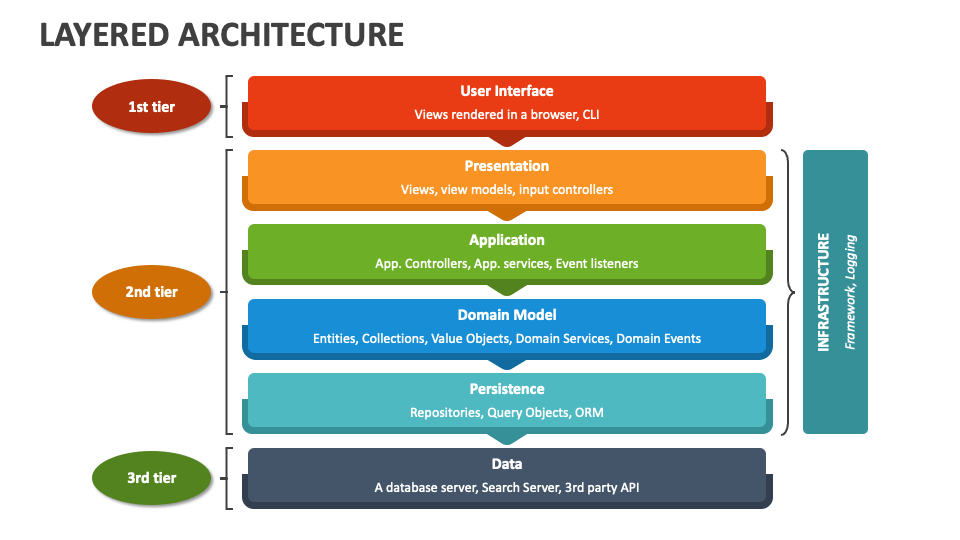
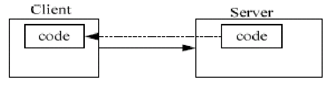

# 부록 C. API 설계자를 위한 필딩 논문 가이드

> 발표일 `25.01.22`

>

> 발표자 `박지환`

## 목차

1. 웹의 구조적 특성
2. REST 구조적 제약
3. 질문

## 1. 웹의 구조적 특성 (웹이 성공한 이유)

1. 낮은 진입 장벽

   - 표준 HTTP 프로토콜
   - 클라이언트 & 서버 상호작용이 명확
   - 

2. 확장성

   - 클라이언트-서버 분리 & 무상태성 -> 트래픽 증가에 대응하기 쉬움
   - 

3. 분산 하이퍼미디어

   - HATEOAS: 동적으로 API를 탐색 가능
   - 서버의 구조나 추가 엔드포인트를 알 필요가 없음
   - 

4. 인터넷-규모

   - "무질서한 규모 확장성": 시스템 부분 사이의 장기적인 관계 X.
   - "독립적인 배포": 장기적인 관계가 없으므로 시스템의 각 부분이 다른 속도로 변화 O.
   - 

## 2. REST 구조적 제약

1. 클라이언트 - 서버

   - 장점: 명확한 역할 분담을 통한 유지보수성 향상
   - 경쟁자: 이벤트 기반 통합 아키텍처 (Web Sockets)
   - 목적: 역할 분담을 통해 유지보수를 쉽게 만들자
   - 

2. 상태 없음 (Stateless)

   - 장점: 서버가 클라이언트의 상태를 저장하지 않으므로 확장성 향상
   - 예시: Session Id는 서버에 저장하면 안 됨
   - 목적: 서버의 확장을 어렵지 않게 하자
   - 

3. 캐싱

   - 장점: 기존 요청의 응답에 매치시켜 네트워크 데이터 송수신 비용 최소화
   - 특징: 자기 서술형 메시지 제약 (응답에 모든 정보가 있음) & 상태 없음 제약 (각 요청은 독립적) 덕분에 캐싱이 가능
   - 목적: 비용을 줄이자
   - 

4. 단일 인터페이스

   - 장점: HTTP 표준을 활용하여 아키텍쳐 단순화
   - 예시: 자원은 URI를 통해 고유하게 식별, HTTP 메서드 활용, 리소스 표현 활용
   - 목적: API 구조를 뻔하게 만들자
   - 

5. 계층화 시스템

   - 장점: 중개자 (프록시/게이트웨이)를 사용하여 확장성을 향상
   - 예시: 한 게이트웨이가 받은 HTTP 요청을 FTP 서버에서 파일을 다운로드하고 HTTP 응답으로 보내줌
   - 목적: 구조화를 하자
   - 

6. 코드 온 디맨드 (선택적 제약 조건)

   - 장점: 클라이언트의 기능을 동적으로 확장
   - 단점: 서버에 종속하는 구조, 보안 이슈, 디버깅 어려움
   - 

## 3. 질문

### Q1.

> 곽재영:

> API 버저닝이 필요한 경우 어떤 방식이 더 좋을까요? (URI 버저닝 vs 헤더 버저닝 vs 파라미터 버저닝 등)

> 각각의 장단점 및 실제 적용 케이스를 소개해주세요.

### A1.

- 버저닝 장단점 참고자료: https://www.xmatters.com/blog/blog-four-rest-api-versioning-strategies
- 실제 적용 케이스 참고자료: https://blog.worldline.tech/2023/08/08/rest-api-versioning-for-dummies.html

<br>

- URI 버저닝

  - 장점: 캐싱이 쉬움

  - 단점: 1. URI 혼잡 2. REST 철학 위반 (URI는 자원을 나타내야함)

- 헤더 버저닝

  - 장점: URI를 깔끔하게 유지 가능 (자원/버전 분리)

  - 단점: 캐싱이 어려움

- 파라미터 버저닝

  - 장점: 간단한 구현 (URI를 변경하지 않고 파라미터만 바꾸면 됨)

  - 단점: 1. 캐싱이 안 될 수도 있음 2. 가시성 부족

<hr>

### Q2.

> 한태혁:

> 캐싱을 적용하기 좋은 HTTP 요청 기준이 있을까요?

> HTTP 요청을 선정하는 기준, 지속시간 등 캐싱에 대한 best practice가 궁금합니다.

### A2.

- TTL 참고자료: https://www.imperva.com/learn/performance/time-to-live-ttl/
- 캐싱 전략 참고자료: https://hazelcast.com/foundations/caching/caching-strategies/

<br>

- 캐싱 적용하기 좋은HTTP 요청

  1.  정적 콘텐츠 (변경 주기가 낮으므로 크게 성능 개선 가능)
  2.  자주 요청되는 GET 메써드 API 응답

<hr>

### Q3.

> 박근영:

> TRACE 메서드는 주로 어떤 동작을 하나요?

### A3.

- TRACE 예시 참고자료: https://apidog.com/blog/http-trace-method/

<br>

- Client - Server Side 간 Loop back Test 를 진행.
- 클라이언트의 요청이 어떻게 처리 되었는지 확인하는 용도. (테스트, 디버깅에 쓰임)

<hr>

### Q4.

> 권희근:

> 웹 API 설계에서 확장성과 인터넷-규모를 택하고 낮은 진입장벽을 포기하는 것이 세부적으로 어떤 비즈니스적/기술적 트레이드오프를 만들어내는지 궁금합니다.

### A4.

"이 답변은 발표자의 개인적인 의견과 ChatGPT의 답변을 종합하여 작성되었습니다"

- 비즈니스적 트레이드오프

      - 장점: 장기적인 경쟁력 확보.
      - 단점: 초기 비용 증가. (문서화, SDK 제공)

- 기술적 트레이드오프

  - 장점: 고성능 및 안정성 (CDN, 캐싱, 비동기 통신).
  - 단점: 복잡성 증가로 인한 응답 속도 저하. (로드 밸런싱 같은 계층으로 인해)

<hr>

### Q5.

> 최준영:

> 프록시와 게이트웨이의 역할에 대해 조금 더 설명해주세요

### A5.

- Proxy & Gateway 참고자료 1: https://coding-start.tistory.com/342
- Proxy & Gateway 참고자료 2: https://velog.io/@hyun-jii/%ED%94%84%EB%A1%9D%EC%8B%9CProxy-vs-%EA%B2%8C%EC%9D%B4%ED%8A%B8%EC%9B%A8%EC%9D%B4Gateway

<hr>

### Q6.

> 서형석:

> 리소스를 식별하는 방식을 결정하는 권한은 서버에만 있는데, 리소스의 의미가 중복되어 간결하게 바꾸고자 합니다.

> 이를 클라이언트가 인지하고 변경하는 방식을 웹에 도입하고자 하면 어떤 방식으로 구현할 수 있을까요?

> 그 방식이 존재한다면 Restful할까요? Restful하지 않다면 어떤 제약조건에서 충돌하는 점이 있을까요?

### A6.

- 클라이언트가 리소스의 의미를 동적으로 이해할 필요가 있는 경우, 서버는 리소스에 대한 응답 시 `명시적 메타데이터`를 함께 제공해야 합니다.
- 예를 들어, `HATEOAS`를 활용하여 서버가 아래와 같은 형태로 응답을 제공한다면 클라이언트는 리소스에 대한 행동 가능성을 명확히 이해할 수 있습니다:

```json
{
  "resource": "/items/123",

  "type": "product",

  "actions": {
    "update": "/items/123/edit",

    "delete": "/items/123/delete",

    "rename": "/items/123/rename"
  }
}
```

- HATEOAS를 활용하는 방식은 RESTful 제약 조건을 준수합니다.
- 리소스의 상태 및 동작 링크를 제공하는 방식은 단일 인터페이스 (Uniform Interface) 제약 조건에 부합하는 RESTful한 설계입니다.

<hr>

### Q7.

> 임해찬:

> HTTP 2.0이 HTTP 1.1과 달라진 점 중에서 428p, 429p에 소개된 웹의 특성과 제약 조건과 관련된 부분만 소개해주시면 감사하겠습니다.

> (ex. 스트림을 통한 다수 요청의 병렬적 처리 등)

### A7.

- HTTP 1.1 vs HTTP 2.0 참고자료: https://www.cloudflare.com/ko-kr/learning/performance/http2-vs-http1.1/

<br>

- HTTP 2.0에서 변경된 부분:

  1.  우선순위 지정 (멀티플렉싱): 다수 요청 병렬 처리

  2.  서버 푸시: 클라이언트 요청 없이 리소스를 미리 보내줌

  3.  헤더 압축: 중복 헤더는 index 값만 전송

- 위 내용들은 요청 처리 속도를 개선함으로써, 인터넷 규모의 제약을 완화하는 데 기여한다고 볼 수 있습니다.
